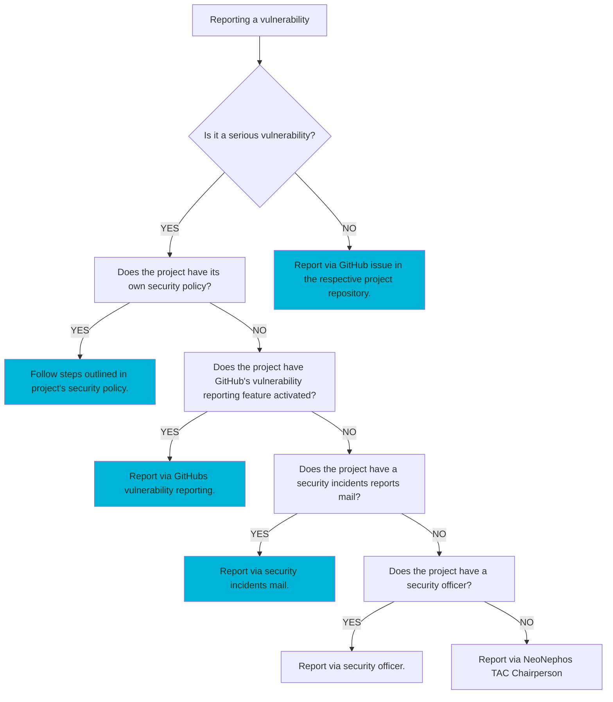
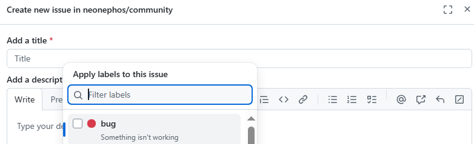
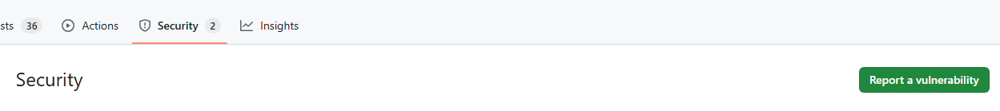

# Policy On Reporting Vulnerabilities

## How To Report A Vulnerability

> [!IMPORTANT]  
> Only report vulnerabilities via the process outlined here.

### Determining Criticality

So you have found a bug or vulnerability in the software of one of our projects. In order to determine the type and recipient of your report, first consider this diagram:



For non-critical vulnerabilities it is best practice to open up a GitHub issue at the respective project repository.



A vulnerability is not necessarily code and can also be intended to mean vulnerabilities in processes, tools, guidelines and more. 
When evaluating a vulnerability for criticality, consider the following:

* Does the vulnerability expose users or developers of our projects to significant danger?
* Does the vulnerability lead to leakage or loss of otherwise private data?
* Does the vulnerability adversely affect the secrecy guarantees posited by our utilized cryptographic primitives?

> [!NOTE]  
> Some examples of critical vulnerabilities:
> * A function uses a low entrophy source of randomness to seed its cryptographic primitives.
> * A text section in a publicly available documentation includes secrets like passwords.
> * A mysql database handling user data is secured with the default password.
> * A TSC member is known to work for an intelligence agency of a state.

### Reporting A Critical Vulnerability

Vulnerability reports propagate upwards in NeoNephos, from project to foundation scope. Therefore, when reporting a critical vulnerability, the first step is to review if a dedicated security policy is available for the project. 

**NeoNephos Projects With A Published Security Policy:**

* **[Gardener Security Policy](https://gardener.cloud/docs/security-and-compliance/)** and **[Gardener Security Release Process](https://github.com/gardener/gardener/security)**
* **[Garden Linux Security Release Process](https://github.com/gardenlinux/gardenlinux/security)**

A project specific vulnerability reporting process always takes precedence over the general reporting process outlined here. If none can be found, check if the organisation has enabled GitHub's vulnerability reporting.



[Reporting a vulnerability via GitHub's inbuilt feature](https://docs.github.com/en/code-security/security-advisories/guidance-on-reporting-and-writing-information-about-vulnerabilities/privately-reporting-a-security-vulnerability) is a secure way to privately diclose your found vulnerability.

If disabled, check for security disclose e-mails or contact details of a member dedicated to handling security reports. The latter can usually be found listed among other Technical Steering Committee members in a ```OWNERS.md```.
As a last resort, [contact the Technical Advisory Council chairperson](https://neonephos.org/technical_advisory_council) to handle the report.

## Related Reading

* Our Security Policy (in the works)
